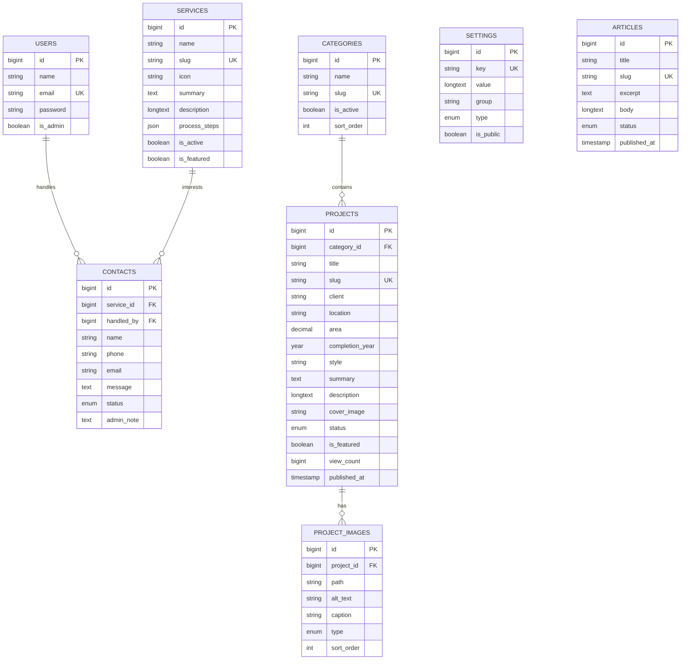

# Thiết kế kỹ thuật ACONS

## 1. Kiến trúc ứng dụng

Ứng dụng là **Modular Monolith theo MVC nhiều lớp**:

```text
Browser
  → Route / Middleware
  → Controller / Form Request
  → Application Service (nghiệp vụ phức tạp)
  → Eloquent Model
  → MySQL
  → Blade View / Redirect
```

`ProjectService` tách nghiệp vụ upload, transaction, slug và lưu gallery ra khỏi controller. Các CRUD đơn giản vẫn đi trực tiếp từ controller sang model để tránh trừu tượng hóa quá mức.

## 2. Database schema



Ngoài bảy bảng lõi, migration nội dung tạo thêm `articles`, `testimonials` và `partners` để đáp ứng Homepage.

## 3. Routes frontend

| Method | URI | Route name | Controller |
|---|---|---|---|
| GET | `/` | `home` | `HomeController` |
| GET | `/du-an` | `projects.index` | `ProjectController@index` |
| GET | `/du-an/{project:slug}` | `projects.show` | `ProjectController@show` |
| GET | `/dich-vu` | `services.index` | `ServiceController@index` |
| GET | `/tin-tuc/{article:slug}` | `articles.show` | `ArticleController@show` |
| GET | `/lien-he` | `contacts.create` | `ContactController@create` |
| POST | `/lien-he` | `contacts.store` | `ContactController@store` |
| POST | `/logout` | `logout` | `Admin\AuthController@logout` |

POST `/lien-he` được giới hạn 5 request/phút cho mỗi client.

## 4. Routes admin

| Method | URI | Route name |
|---|---|---|
| GET | `/admin/login` | `admin.login` |
| POST | `/admin/login` | `admin.login.store` |
| GET | `/admin` | `admin.dashboard` |
| GET | `/admin/projects` | `admin.projects.index` |
| GET | `/admin/projects/create` | `admin.projects.create` |
| POST | `/admin/projects` | `admin.projects.store` |
| GET | `/admin/projects/{project}/edit` | `admin.projects.edit` |
| PUT/PATCH | `/admin/projects/{project}` | `admin.projects.update` |
| DELETE | `/admin/projects/{project}` | `admin.projects.destroy` |
| DELETE | `/admin/project-images/{projectImage}` | `admin.project-images.destroy` |
| GET/POST | `/admin/categories[/create]` | `admin.categories.*` |
| GET/PUT/DELETE | `/admin/categories/{category}[/edit]` | `admin.categories.*` |
| GET/POST | `/admin/services[/create]` | `admin.services.*` |
| GET/PUT/DELETE | `/admin/services/{service}[/edit]` | `admin.services.*` |
| GET | `/admin/contacts` | `admin.contacts.index` |
| GET | `/admin/contacts/{contact}` | `admin.contacts.show` |
| PUT/PATCH | `/admin/contacts/{contact}` | `admin.contacts.update` |
| DELETE | `/admin/contacts/{contact}` | `admin.contacts.destroy` |
| GET | `/admin/settings` | `admin.settings.edit` |
| PUT | `/admin/settings` | `admin.settings.update` |

Toàn bộ route sau đăng nhập dùng middleware `auth` và `admin`.

## 5. AdminLTE 4

Assets được lấy trực tiếp từ package npm chính thức của repository AdminLTE:

```powershell
npm install admin-lte bootstrap bootstrap-icons overlayscrollbars
npm run build
```

Vite có bốn entry points:

```js
input: [
    'resources/css/app.css',
    'resources/js/app.js',
    'resources/css/adminlte.css',
    'resources/js/adminlte.js',
]
```

AdminLTE 4 dùng Bootstrap 5.3 và JavaScript thuần; jQuery chỉ được nạp cho tương tác frontend của ACONS. Layout `layouts.admin` chứa khung AdminLTE hoàn chỉnh, nên các trang CRUD dùng chung navigation, flash/error UI và không lặp markup.

## 6. Bảo mật

- Mọi form thay đổi dữ liệu có `@csrf`.
- Controller dùng Form Request hoặc `$request->validate()`.
- Blade hiển thị nội dung bằng `{{ }}`; nội dung nhập từ admin không render bằng `{!! !!}`.
- Upload chỉ nhận JPG/JPEG/PNG/WebP, tối đa 8 MB mỗi ảnh; logo tối đa 4 MB.
- Sau đăng nhập và đăng xuất đều tái tạo session/token.
- Admin middleware kiểm tra cờ `users.is_admin`.
- Không có route đăng ký công khai cho tài khoản quản trị.
- Contact form có honeypot và rate limit.
- Slug được chuẩn hóa và kiểm tra duy nhất.

## 7. Hướng mở rộng

Khi chuyển từ starter sang production, nên bổ sung CRUD bài viết/testimonial/partner, phân quyền chi tiết theo role/permission, resize ảnh bằng queue, audit log, sitemap XML, structured data, backup tự động và cache trang/dữ liệu.
